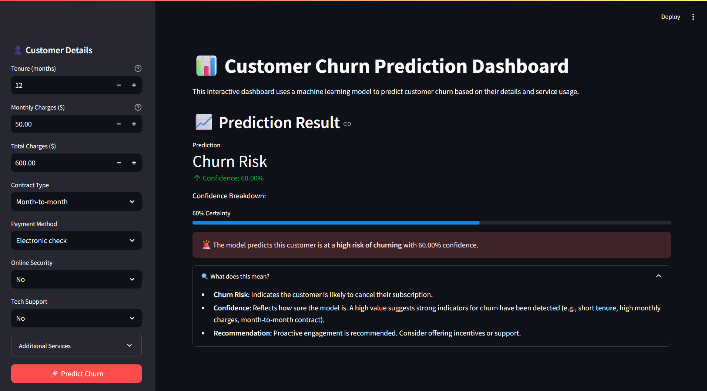

# 📊 Customer Churn Prediction App

A user-friendly web application built with Streamlit that leverages a machine learning model to predict customer churn in real-time. This tool helps businesses proactively identify and retain at-risk customers.

[](https://customer-churn-prediction-app-by-tushar-chaudhari.streamlit.app/)
 
---

## 🌟 Key Features

-   **Interactive Interface**: A clean and intuitive UI in the sidebar allows users to input customer data easily.
-   **Real-Time Predictions**: Instantly get a churn prediction ("Churn Risk" or "Likely to Stay") based on the input data.
-   **Confidence Score**: Each prediction is accompanied by a confidence percentage, indicating the model's certainty.
-   **Feature Importance Analysis**: Visualize the key factors (e.g., contract type, tenure) that most influence the model's prediction.
-   **Responsive Design**: The app is fully functional on both desktop and mobile devices.

---

## 🚀 Live Demo

You can test the live application here:
**[ customer-churn-prediction-app](https://customer-churn-prediction-app-by-tushar-chaudhari.streamlit.app/)**

---

## 📸 App Preview




---

## 🛠️ Technology Stack

This project is built with a modern Python stack for machine learning and web development:

-   **Backend & Machine Learning**:
    -   `Python`
    -   `scikit-learn`: For machine learning pipelines and preprocessing.
    -   `XGBoost`: The gradient boosting model used for prediction.
    -   `Pandas`: For data manipulation and handling.
    -   `Joblib`: For saving and loading the trained model and encoders.

-   **Frontend**:
    -   `Streamlit`: For creating and deploying the interactive web app.
    -   `Matplotlib`: For generating the feature importance plot.

---


## ⚙️ Setup and Installation

To run this project locally, follow these steps:

 
1.  **Install the required dependencies:**
    ```bash
    pip install -r requirements.txt
    ```

2.  **Run the Streamlit app:**
    ```bash
    streamlit run app1.py
    ```

The application will now be running and accessible in your web browser at `http://localhost:8501`.

---

## 👤 Author

**Tushar Chaudhari**

-   **GitHub:** [@iTushar09](https://github.com/iTushar09)

---

 
